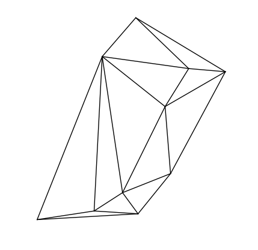
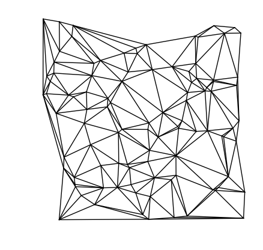
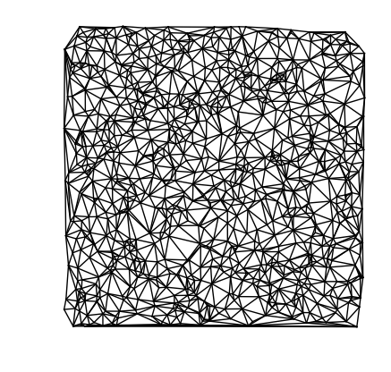

# Delaunay Triangulation

Project for CSCI5010@CUHK (Practical Computational Geometry Algorithms, 2018 Spring)

Gengjie Chen

\# points | time (s) | result
-|-|-
10 | 0.000139 | 
100 | 0.00177 | 
1000 | 0.0233 | 

Reference: Lecture 13 of [Dave Mount's Lecture Notes](https://www.cse.cuhk.edu.hk/~taoyf/course/5010/notes/mount-cg2.pdf)

### Compile:
```
g++ -std=c++11 main.cpp triangulation.cpp dcel.cpp -o triangulation -O3 -DNDBUG
```

### Run:
```
./triangulation -f <input_file>
```
(For input file `xxx.txt`, the output file will be `xxx_output.txt`.)

### Visualize:
```
./draw <output_file>
```

### Known Limitations:

* Destructor of class `Triangulation` is not yet implemented.
* Support bulk loading only. (Point-face relationship is maintained and updated together with the face-points relationship during the incremental insertion. The point-location data structure can enable incremental query.)
